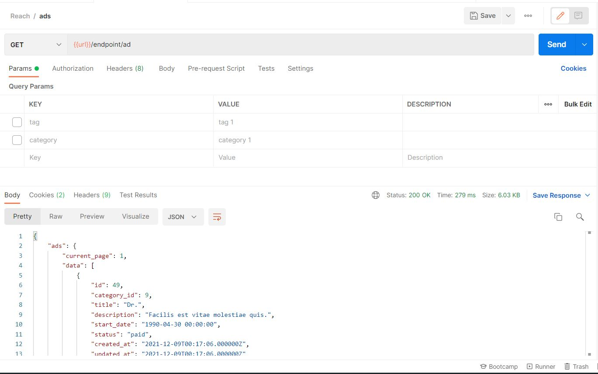
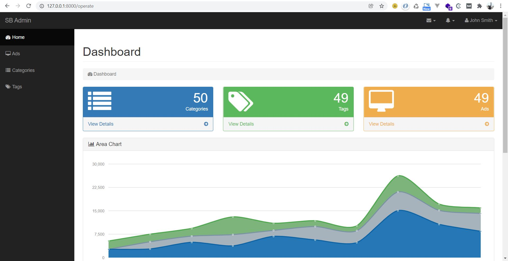
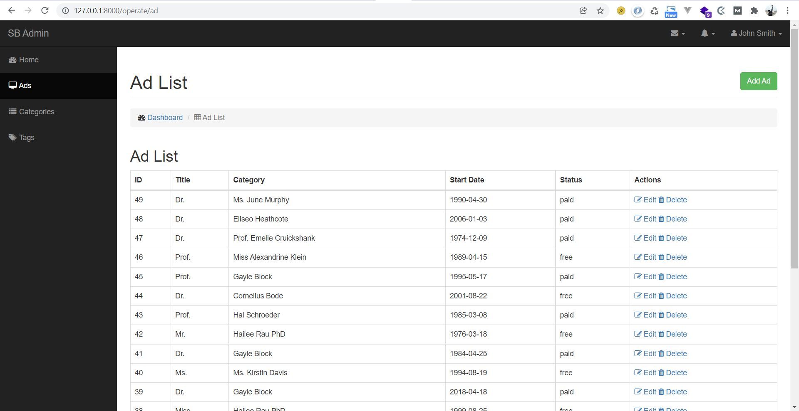

## Reach Task

##Backend
###Simple Ads API
Create a simple Ads management API that shows ads and related tags/categories. It will be a part of a module handling the Advertiser
functionalities towards these ads. Since advertiser will be assigned with an ad to start and should include the following:
###Ads Attributes:
type(free/paid), title, description, category, tags, advertiser, start_date. 
-Each Ad is created under one category and has many related tags 
-One category can have many ads and each Ad is related to one category. 
-schedule a daily email at 08:00 PM that will be sent to advertisers who have ads the next day as a remainder. 
Endpoints should contains: -Tags (CRUD) 
-Categories (CRUD) 
-Ads filters (by tag, by category) -Showing Advertiser Ads  
####Notes:
-Use any recent version of laravel framework. 
-It will not be necessary to do any Authentication, you can just seed the database with some advertiser to be linked with Ads. 
-You should implement this project in clean code and always take care of scalability. 
-Create a public github repository and push your project to it. 

## Laravel 8 PHP Framework

## Tutorial

##### 1. install composer of project composer install
##### 2. run seeder of project php artisan db:seed
##### 3. using postman document to guid you to apis:  
https://documenter.getpostman.com/view/8316268/UVJkBtCj

## Coding

##### 1. Find core logic in "app/Modules/Ad" folder. 

## Postman Result ScreenShot

## Admin Panel Result ScreenShot

## Tools

#### Programming Language: PHP 7.2
#### Framework: Laravel 8.0
